# Rehan Raja — GitHub README

<div align="center">

<!--  -->
<!--  -->

<div align="center">
  
</div>

<!--  -->

</div>

```text
rehan-raja/
│
├── 📄 about-me.ts
├── 📁 blockchain/
├── 📁 artificial-intelligence/
├── 📁 full-stack/
├── 📁 browser-extensions/
├── 📁 foundations/
└── 🏆 achievements.md
```

<div align="center">
  
</div>

<details>
<summary><b>📄 &gt; cat about-me.ts</b></summary>

<br/>

```typescript
const developer = {
  name: "Rehan Raja",
  university: "Capital University of Science & Technology",
  focus: "Blockchain / Web3 Engineering",

  foundation: [
    "C++",
    "JavaScript / TypeScript",
    "MERN Stack"
  ],

  currentlyExploring: [
    "Smart Contract Architecture",
    "DeFi & dApps",
    "AI-powered Products",
    "Open Source"
  ],

  goal: "Turn real problems into working systems."
};
```

</details>

<div align="center">
  
</div>

<details>
<summary><b>⛓️ &gt; tree ./blockchain</b></summary>

<br/>

```text
blockchain/
│
├── ProofWork/
│   └── Web3 talent marketplace
│       licensing • escrow • milestones • verifiable work
│
├── NFT-Marketplace/
│   └── ERC-721 mint • list • buy • cancel • resell
│
├── Web3-Governance/
│   └── proposals • wallet voting • results • analytics
│
└── Solidity-Labs/
    └── smart contracts • testing • EVM experiments
```

**Core Stack**

`Solidity` `Hardhat` `ethers.js` `OpenZeppelin` `EVM`

</details>

<div align="center">
  
</div>

<details>
<summary><b>🚀 &gt; tree ./projects</b></summary>

<br/>

```text
🤖 artificial-intelligence/
│
├── TruthLens AI
│   └── Cross-platform reality mapping & verification
│
└── Insight Engine
    └── AI-assisted authentic content for founders


🌐 full-stack/
│
├── BUY-ZAR
│   └── MERN e-commerce • JWT • cart • orders • admin
│
├── Notes App
├── Chat Applications
└── Authentication Systems


🧩 browser-extensions/
│
├── Multimodal AI Extension
├── Student Task Tracker
└── Extension Community Platform
```

</details>

<div align="center">
  
</div>

<details>
<summary><b>⚙️ &gt; tree ./foundations</b></summary>

<br/>

```text
foundations/
│
├── C++/
│   ├── Guess The Number
│   ├── Tic-Tac-Toe
│   ├── Snake
│   ├── Rock Paper Scissors
│   ├── Shooting Game
│   └── Management Systems
│
├── competitive-programming/
│   └── strings • graphs • trees • algorithms
│
└── systems/
    └── threads • mutexes • sockets • concurrency
```

</details>

<div align="center">
  
</div>

<details>
<summary><b>🏆 &gt; cat achievements.md</b></summary>

<br/>

```diff
+ Runner-Up — NamalTech Expo 2025
  Line Following Robot

+ Competitive Programming — FAST-NUCES Islamabad
  Problem solving • algorithms • graphs • trees

+ Replit Buildathon — Islamabad 2026
  Built TruthLens AI
```

</details>

<div align="center">
  
</div>

<details>
<summary><b>🛠️ &gt; ./skills --list</b></summary>

<br/>

<div align="center">

### ⛓️ Web3


`Solidity` • `Hardhat` • `ethers.js` • `OpenZeppelin`

### 🌐 Development


### ⚙️ Foundations & Tools


<br/>

`REST APIs` • `Bootstrap` • `Tailwind` • `Socket.io` • `Hardhat`

</div>

</details>

<div align="center">
  
</div>

<details>
<summary><b>🔄 &gt; git status</b></summary>

<br/>

```diff
+ Building deeper Blockchain / Web3 skills
+ Developing production-style dApps
+ Learning smart-contract architecture & testing
+ Preparing for junior Web3 / freelance opportunities
+ Looking toward open-source contributions
```

### Currently looking for

```text
[✓] Blockchain / Web3 Internships
[✓] Software Engineering Internships
[✓] Open-Source Collaboration
[✓] Hackathons & Buildathons
[✓] Junior Web3 Opportunities
```

</details>

<div align="center">
  
</div>

### 🖥️ Hit this in your terminal to connect with me

```bash
npx connect-with-rehan --secure
```

> Not an actual npm package — just my developer-style way of saying hello 😄

<div align="center">
  
</div>

<details>
<summary><b>📊 GitHub Stats — Live & Real</b></summary>

<br/>

<div align="center">


<br/><br/>


<br/><br/>


</div>

</details>

<div align="center">
  
</div>

<details>
<summary><b>📈 &gt; waka --activity</b></summary>

<br/>

<!--START_SECTION:waka-->


**🐱 My GitHub Data** 

> 📦 189.9 kB Used in GitHub's Storage 
 > 
> 🏆 75 Contributions in the Year 2026
 > 
> 💼 Opted to Hire
 > 
> 📜 23 Public Repositories 
 > 
> 🔑 9 Private Repositories 
 > 
**I'm a Night 🦉** 

```text
🌞 Morning                15 commits          ██░░░░░░░░░░░░░░░░░░░░░░░   07.18 % 
🌆 Daytime                51 commits          ██████░░░░░░░░░░░░░░░░░░░   24.40 % 
🌃 Evening                53 commits          ██████░░░░░░░░░░░░░░░░░░░   25.36 % 
🌙 Night                  90 commits          ███████████░░░░░░░░░░░░░░   43.06 % 
```
📅 **I'm Most Productive on Saturday** 

```text
Monday                   15 commits          ██░░░░░░░░░░░░░░░░░░░░░░░   07.18 % 
Tuesday                  36 commits          ████░░░░░░░░░░░░░░░░░░░░░   17.22 % 
Wednesday                19 commits          ██░░░░░░░░░░░░░░░░░░░░░░░   09.09 % 
Thursday                 10 commits          █░░░░░░░░░░░░░░░░░░░░░░░░   04.78 % 
Friday                   35 commits          ████░░░░░░░░░░░░░░░░░░░░░   16.75 % 
Saturday                 55 commits          ███████░░░░░░░░░░░░░░░░░░   26.32 % 
Sunday                   39 commits          █████░░░░░░░░░░░░░░░░░░░░   18.66 % 
```


📊 **This Week I Spent My Time On** 

```text
🕑︎ Time Zone: Asia/Karachi

💬 Programming Languages: 
No Activity Tracked This Week

🔥 Editors: 
No Activity Tracked This Week

💻 Operating System: 
No Activity Tracked This Week
```

🤖 **AI Coding This Week** 

```text
No AI Coding Activity Tracked This Week
```

**I Mostly Code in JavaScript** 

```text
JavaScript               15 repos            ████████████████░░░░░░░░░   62.50 % 
Solidity                 3 repos             ███░░░░░░░░░░░░░░░░░░░░░░   12.50 % 
CSS                      3 repos             ███░░░░░░░░░░░░░░░░░░░░░░   12.50 % 
TypeScript               1 repo              █░░░░░░░░░░░░░░░░░░░░░░░░   04.17 % 
C++                      1 repo              █░░░░░░░░░░░░░░░░░░░░░░░░   04.17 % 
```


 Last Updated on 26/08/2026 00:15:27 UTC
<!--END_SECTION:waka-->

</details>

<div align="center">
  
</div>

### 📫 Like to meet me?

<a href="https://calendly.com/YOUR_CALENDLY_USERNAME/30min">
  
</a>

<br/><br/>

I enjoy connecting with developers, founders, students, Web3 builders and people working on interesting technical problems.

<div align="center">
  
</div>

## 🔗 Connect With Me

<div align="center">

<a href="YOUR_LINKEDIN_URL">

</a>

<a href="mailto:YOUR_EMAIL">

</a>

<a href="https://github.com/Raja-Shayyam">

</a>

</div>

<br/>

```text
────────────────────────────────────────────────────────────
 main*    Ln 42, Col 18    UTF-8    Solidity    ◉ Building
────────────────────────────────────────────────────────────
```

<div align="center">

### `< Building. Breaking. Debugging. Learning. />`


</div>
